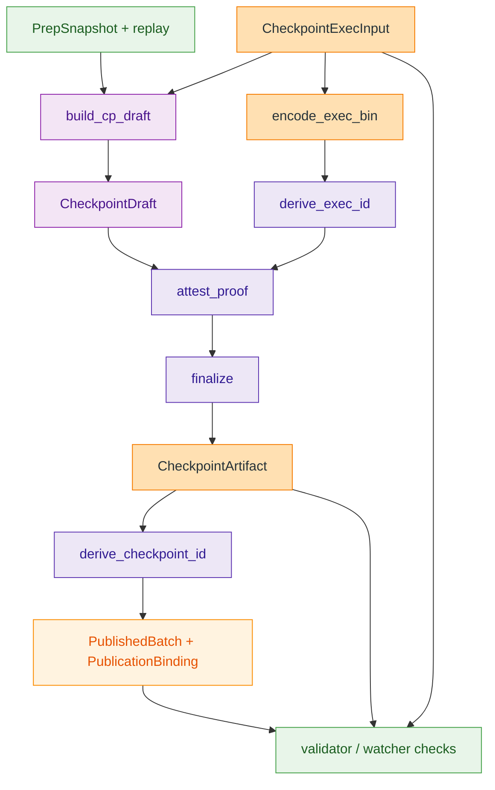

## 🎯 Коротко

В этом repo `checkpoint` не является просто “номером” или `tx`-хешем. Финальная сущность здесь — `CheckpointArtifact`: он фиксирует переход состояния `prev_root -> new_root`, settlement-roots, `spent_delta`/`created_delta`, ссылки на `prep_snapshot_id` и `exec_input_id`, плюс proof payload [`crates/z00z_storage/src/checkpoint/artifact_final.rs:13`](https://github.com/vasja34/z00z/blob/z00z-dev/crates/z00z_storage/src/checkpoint/artifact_final.rs#L13). Его `checkpoint_id` считается только из канонических байтов финального artifact, а не из имени файла, `fragment_ids` или `prep_snapshot_id` отдельно [`crates/z00z_storage/src/checkpoint/ids.rs:166`](https://github.com/vasja34/z00z/blob/z00z-dev/crates/z00z_storage/src/checkpoint/ids.rs#L166).

Отдельно важно: до публикации runtime живет на `BatchId`, который оборачивает `CheckpointDraftId`; уже опубликованный результат несет именно `checkpoint_id` [`crates/z00z_runtime/aggregators/src/types.rs:27`](https://github.com/vasja34/z00z/blob/z00z-dev/crates/z00z_runtime/aggregators/src/types.rs#L27), [`crates/z00z_runtime/aggregators/src/types.rs:287`](https://github.com/vasja34/z00z/blob/z00z-dev/crates/z00z_runtime/aggregators/src/types.rs#L287).

## ⚙️ Где считается

Черновой checkpoint считается в `apply_batch_checkpoint()`: функция проверяет `prev_root`, входы, выходы, tx proof, spent-index, меняет settlement state и возвращает `CheckpointDraft` [`crates/z00z_storage/src/checkpoint/build.rs:258`](https://github.com/vasja34/z00z/blob/z00z-dev/crates/z00z_storage/src/checkpoint/build.rs#L258). Если путь идет от snapshot replay, `build_cp_draft()` собирает тот же draft из `PrepSnapshot + replay + link + exec_input` [`crates/z00z_storage/src/checkpoint/build.rs:356`](https://github.com/vasja34/z00z/blob/z00z-dev/crates/z00z_storage/src/checkpoint/build.rs#L356).

Финальный checkpoint считается позже, в publication/DA path. `artifact_for_request()` сериализует `CheckpointExecInput`, выводит `exec_input_id`, делает `draft.attest_proof(...)`, а затем `draft.finalize(...)` в `CheckpointArtifact` [`crates/z00z_rollup_node/src/da.rs:330`](https://github.com/vasja34/z00z/blob/z00z-dev/crates/z00z_rollup_node/src/da.rs#L330). После этого `publish_checkpoint()` вычисляет `checkpoint_id`, строит `PublicationBinding` и выпускает `PublishedBatch` [`crates/z00z_rollup_node/src/da.rs:179`](https://github.com/vasja34/z00z/blob/z00z-dev/crates/z00z_rollup_node/src/da.rs#L179), [`crates/z00z_runtime/aggregators/src/service.rs:55`](https://github.com/vasja34/z00z/blob/z00z-dev/crates/z00z_runtime/aggregators/src/service.rs#L55).

В simulator `stage_9/build_exec_input()` только готовит `CheckpointExecInput` из `snap_id`, `prev_root`, tx package и outputs; финальный `checkpoint_id` там еще не выводится [`crates/z00z_simulator/src/scenario_1/stage_9/exec_input_builder.rs:41`](https://github.com/vasja34/z00z/blob/z00z-dev/crates/z00z_simulator/src/scenario_1/stage_9/exec_input_builder.rs#L41).

## 🔗 Как работает

1. `CheckpointExecInput` хранит упорядоченные input refs, outputs и точные `tx_proof` bytes; пустой набор tx запрещен [`crates/z00z_storage/src/checkpoint/exec_input.rs:126`](https://github.com/vasja34/z00z/blob/z00z-dev/crates/z00z_storage/src/checkpoint/exec_input.rs#L126), [`crates/z00z_storage/src/checkpoint/exec_input.rs:231`](https://github.com/vasja34/z00z/blob/z00z-dev/crates/z00z_storage/src/checkpoint/exec_input.rs#L231).
2. `CheckpointDraft` описывает сам переход состояния, но еще без финальной identity/binding [`crates/z00z_storage/src/checkpoint/artifact_proof_draft.rs:71`](https://github.com/vasja34/z00z/blob/z00z-dev/crates/z00z_storage/src/checkpoint/artifact_proof_draft.rs#L71).
3. `attest_proof()` строит statement из draft + `prep_snapshot_id` + `exec_input_id`, а `finalize()` проверяет соответствие `pub_in` и statement и делает final artifact [`crates/z00z_storage/src/checkpoint/artifact_proof_draft.rs:193`](https://github.com/vasja34/z00z/blob/z00z-dev/crates/z00z_storage/src/checkpoint/artifact_proof_draft.rs#L193), [`crates/z00z_storage/src/checkpoint/artifact_proof_draft.rs:225`](https://github.com/vasja34/z00z/blob/z00z-dev/crates/z00z_storage/src/checkpoint/artifact_proof_draft.rs#L225).
4. `SettlementTheoremBundle::new()` сразу валидирует bundle: verifier заново кодирует `exec_input`, пересчитывает `exec_id`, сверяет link, roots и `checkpoint_id` [`crates/z00z_runtime/validators/src/verdict.rs:115`](https://github.com/vasja34/z00z/blob/z00z-dev/crates/z00z_runtime/validators/src/verdict.rs#L115), [`crates/z00z_runtime/validators/src/verdict.rs:239`](https://github.com/vasja34/z00z/blob/z00z-dev/crates/z00z_runtime/validators/src/verdict.rs#L239).
5. Watcher потом проверяет, что `PublishedBatch.checkpoint_id`, `PublicationBinding` и `pub_in` не разъехались [`crates/z00z_runtime/watchers/src/publication.rs:43`](https://github.com/vasja34/z00z/blob/z00z-dev/crates/z00z_runtime/watchers/src/publication.rs#L43), [`crates/z00z_runtime/aggregators/src/types.rs:398`](https://github.com/vasja34/z00z/blob/z00z-dev/crates/z00z_runtime/aggregators/src/types.rs#L398).

Diagram plan:

- `flowchart TD`: одного data-flow достаточно, потому что вопрос про вычисление и назначение checkpoint.

Not shown:

- внутренности `CheckpointStmt` и `CheckpointLink`, потому что для ответа достаточно их роли в binding/verification.

## ✅ Для чего нужен

- Чтобы иметь канонический артефакт перехода состояния, а не просто “успешную tx”.
- Чтобы получить content-addressed `checkpoint_id`, который однозначно привязан к финальному artifact [`crates/z00z_storage/src/checkpoint/ids.rs:166`](https://github.com/vasja34/z00z/blob/z00z-dev/crates/z00z_storage/src/checkpoint/ids.rs#L166).
- Чтобы привязать публикацию к конкретному `batch_id + checkpoint_id + route_table_digest + pub_in` через `PublicationBinding` [`crates/z00z_runtime/aggregators/src/types.rs:311`](https://github.com/vasja34/z00z/blob/z00z-dev/crates/z00z_runtime/aggregators/src/types.rs#L311), [`crates/z00z_runtime/aggregators/src/types.rs:528`](https://github.com/vasja34/z00z/blob/z00z-dev/crates/z00z_runtime/aggregators/src/types.rs#L528).
- Чтобы validator и watcher могли обнаружить рассинхрон между execution input, link, artifact и published state [`crates/z00z_runtime/validators/src/verdict.rs:239`](https://github.com/vasja34/z00z/blob/z00z-dev/crates/z00z_runtime/validators/src/verdict.rs#L239), [`crates/z00z_runtime/watchers/src/publication.rs:43`](https://github.com/vasja34/z00z/blob/z00z-dev/crates/z00z_runtime/watchers/src/publication.rs#L43).

## 📁 Key Files

| File                                                         | Role                                                         |
| ------------------------------------------------------------ | ------------------------------------------------------------ |
| [`crates/z00z_storage/src/checkpoint/build.rs:258`](https://github.com/vasja34/z00z/blob/z00z-dev/crates/z00z_storage/src/checkpoint/build.rs#L258) | Считает state transition и выдает `CheckpointDraft`          |
| [`crates/z00z_storage/src/checkpoint/artifact_proof_draft.rs:71`](https://github.com/vasja34/z00z/blob/z00z-dev/crates/z00z_storage/src/checkpoint/artifact_proof_draft.rs#L71) | Определяет `CheckpointDraft`, `attest_proof()`, `finalize()` |
| [`crates/z00z_storage/src/checkpoint/artifact_final.rs:13`](https://github.com/vasja34/z00z/blob/z00z-dev/crates/z00z_storage/src/checkpoint/artifact_final.rs#L13) | Определяет финальный `CheckpointArtifact`                    |
| [`crates/z00z_storage/src/checkpoint/ids.rs:166`](https://github.com/vasja34/z00z/blob/z00z-dev/crates/z00z_storage/src/checkpoint/ids.rs#L166) | Выводит `checkpoint_id` и `exec_input_id`                    |
| [`crates/z00z_rollup_node/src/da.rs:179`](https://github.com/vasja34/z00z/blob/z00z-dev/crates/z00z_rollup_node/src/da.rs#L179) | Публикует checkpoint и формирует `PublishedBatch`            |
| [`crates/z00z_runtime/validators/src/verdict.rs:239`](https://github.com/vasja34/z00z/blob/z00z-dev/crates/z00z_runtime/validators/src/verdict.rs#L239) | Проверяет, что artifact, exec input и link согласованы       |
| [`crates/z00z_runtime/watchers/src/publication.rs:43`](https://github.com/vasja34/z00z/blob/z00z-dev/crates/z00z_runtime/watchers/src/publication.rs#L43) | Следит, что published checkpoint не разъехался с runtime evidence |

EXPANDABLE: details available for `CheckpointLink`, `CheckpointStmt`, и различия между `draft_id`, `exec_input_id` и `checkpoint_id`.
